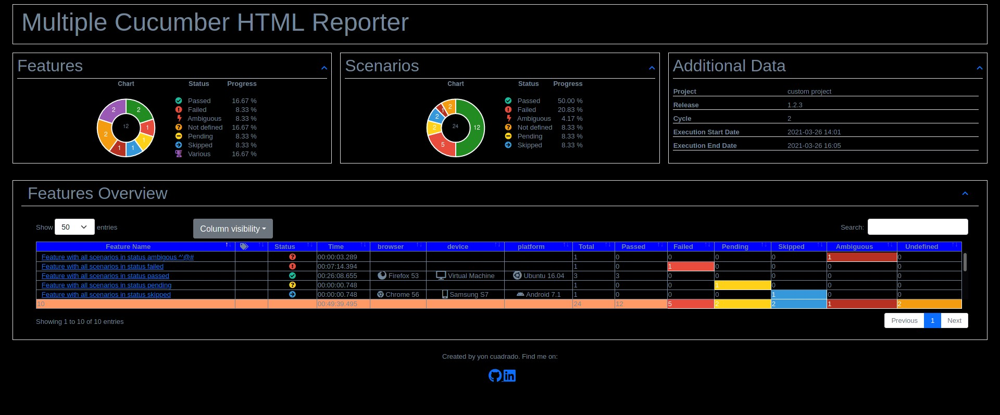
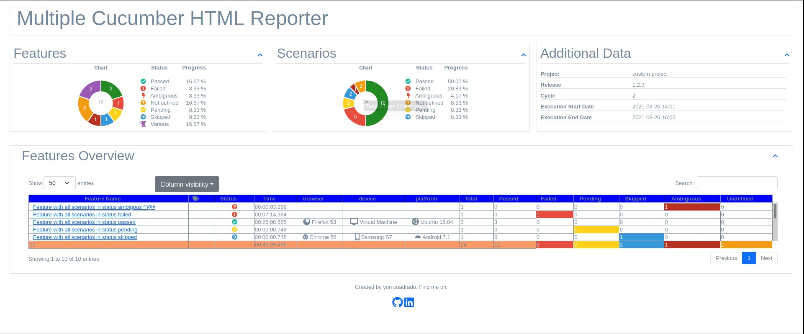

html-cucumber-report-generator
===============================
[](http://opensource.org/licenses/MIT)

[](https://nodei.co/npm/cucumber-html-report-generator/)

This project is based in the project https://www.npmjs.com/package/multiple-cucumber-html-reporter
As with the original project html-cucumber-report-generator is a reporting module for Cucumber to parse the JSON output to a beautiful report. The differences between the previous project and this one are the following ones:
- written with typescript
- option to display Outline scenarios in a grouped way
- Option to store the reports in a mongodb database and access them from a web page
- Dark and light themes





A sample with dark theme and report metadata can be found [here](./docs/report-with-dark-theme/report-with-dark-theme-and-report-metadata/index.html)
and a sample with light theme and report metadata can be found [here](./docs/report-with-dark-theme/report-with-light-theme-and-report-metadata/index.html)

And a sample with dark theme without report metadata can be found [here](./docs/report-with-dark-theme/report-with-dark-theme-without-report-metadata/index.html)
and a sample with light theme without report metadata can be found [here](./docs/report-with-dark-theme/report-with-light-theme-without-report-metadata/index.html)


## Install
Install this module locally with the following command:

``` bash
npm install cucumber-html-report-generator
```

Save to dependencies or dev-dependencies:

``` bash
npm install cucumber-html-report-generator --save
npm install cucumber-html-report-generator --save-dev
```

## Compatibility
Multiple Cucumber HTML Reporter **has been tested with the latest version of webdriverio 7.10 and it should work with the latest versions of cucumber.** 

> **IMPORTANT:**

> Make sure that, when you generate the JSON files with Cucumber, each file will have a **UNIQUE** name. If you don't provide a unique name Cucumber will **override** the JSON files.

> **Advice** is to use for example the name of the feature, the name of the browser / device it is running on AND a unix timestamp with for example this `(new Date).getTime();`. This will result in something like this `name_of_feature.chrome.1495298685509.json`

## Options
```
  showExecutionTime?: boolean;
  openReportInBrowser?: boolean;
  navigateToFeatureIfThereIsOnlyOne?: boolean;
  theme?: string;
  customStyle?: string;
  overrideStyle?: string;
  reportPath?: string;
  disableLog?: boolean;
  useCDN?: boolean;
  reportTitle?: string;
  jsonDir: string;
  reportMetadataTitle?: string;
  reportMetadata?: Metadata[];
  featuresFolder?: string;
  saveReportInMongoDb?: boolean;
  saveCollectedJSON?: boolean;
  saveEnrichedJSON?: boolean;
  mongooseServerUrl?:string;
```

#### `showExecutionTime`
- **Type:** `Boolean`
- **Mandatory:** No
- **DefaultValue:** False

If true it will show the execution time in the features summary page and in the feature details

#### `openReportInBrowser`
- **Type:** `Boolean`
- **Mandatory:** No
- **DefaultValue:** False

If true it will make that the generated report is opened in the default browser

#### `navigateToFeatureIfThereIsOnlyOne`
- **Type:** `Boolean`
- **Mandatory:** No
- **DefaultValue:** False

This option is used in conjunction with the previous one. In case the generated report only has one feature, the report opens directly 
in the feature detail.

#### `theme`
- **Type:** `String`
- **Mandatory:** No
- **Options:** Dark, Light
   
With this option it is possible to select the theme of the report, by default, if the property si not included it is selected the dark theme. You can select the light theme with the 'Light' value

#### `customStyle`
- **Type:** `String`
- **Mandatory:** No

With this option it is possible to pass a custom style css to the report. This style will be copied at the end of the current style.
Add it like this `customStyle: 'your-path-where/custom.css'`

### `overrideStyle`
- **Type:** `path`
- **Mandatory:** No

If you need replace default style for your report. Add it like this `overrideStyle: 'your-path-where/custom.css'`

#### `reportPath`
- **Type:** `String`
- **Mandatory:** No

Using this option is possible to indicate the path where the report is going to be created. When no value is provided then the report will be created in the  folder cucumber-html-report-generator/YYYY-MM-DD_HH-mm-ss

#### `disableLog`
- **Type:** `Boolean`
- **Mandatory:** No
- **DefaultValue:** False

This will disable the log so will **NOT** see this.

```shell
=====================================================================================
    Cucumber HTML Report Generator report generated in:

    /Users/wswebcreation/multiple-cucumber-html-reporter/.tmp/index.html
========================================================================
```

#### `useCDN`
- **Type:** `Boolean`
- **Mandatory:** No
- **DefaultValue:** False

With a true value the html resources are obtained from a cdn and with a false value they are obtained from
a subfolder in the report location.

#### `reportTitle`
- **Type:** `String`
- **Mandatory:** No
- **DefaultValue:** False

It is the features page title and it has the default value "Cucumber HTML Report Generator" 

#### `jsonDir`
- **Type:** `String`
- **Mandatory:** Yes

It is the folder where the cucumber execution result json files are located

#### `reportMetadataTitle`
- **Type:** `string`
- **Mandatory:** No

It displays a custom title in the report. If this parameter is not provided the value "Additional Data" and there is a valid value in the parameter reportMetadata
different than null

#### `reportMetadata`
- **Type:** `Metadata[]`
- **Mandatory:** No

It is the metadata that is going to be included in the report. The metadata has to be provided as an object with the properties:
    - name
    - value
    - icon (optional)

The icon value can be obtained from the following page: https://fontawesome.com/v5.15/icons?d=gallery&p=2&m=free
```
metadata: [
        { name: 'project', value: 'custom project'},
        { name: 'release', value: '1.2.3' },        
        { name: 'Cycle', value: '2' }
        { name: 'Execution Start Date', value: '2021-03-26 14:01' },
        { name: 'Execution End Date', value: '2021-03-26 16:05' }
    ]

```

### Adding metadata to the Cucumber JSON

To be able to see this you will need to add the following to the Cucumber JSON before you save it.


```javascript
// This represents the Cucumber JSON file that has be retrieved
const cucumberJSON;

const metadata = {
	"browser": {
		"name": "chrome",
		"version": "58"
	},
	"device": "string",
	"platform": {
		"name": "osx",
		"version": "10.12"
	}
}

// Add it with for example
cucumberJSON[0].metadata = metadata;

// Now save the file to the disk
```

#### `featuresFolder`
- **Type:** `String`
- **Mandatory:** No

It is the folder with the feature files

#### `saveReportInMongoDb`
- **Type:** `Boolean`
- **Mandatory:** No

With this parameter it is decided if the report is going to be saved in the mongoDb database specified with the parameter mongooseServerUrl.
The default value is false.

### `saveCollectedJSON`
- **Type:** `boolean`
- **Mandatory:** No

This module will first merge all the JSON-files to 1 file and then enrich it with data that is used for the report. If `saveCollectedJSON :true` the merged JSON will be saved in the `reportPath`. They will be saved as:

- `merged-output.json`

#### `saveEnrichedJSON`
- **Type:** `Boolean`
- **Mandatory:** No

- `enriched-output.json`

It allows to save the json report of the joined cucumber json reports with the specifications to generate the html report in the report folder. They will be saved as:

#### `mongooseServerUrl`
- **Type:** `String`
- **Mandatory:** No

It defines the url of the mongodb server. if no value is provided the value http://localhost:3000. It depends on the project x

## FAQ
### Only 1 report is shown in the features overview table
It could be that the name of the Cucumber JSON file that has been saved is not unique (enough).

My advice is to use for example:

- the name of the feature
- the name of the browser / device it is running on
- a unix timestamp with for example this `(new Date).getTime();`

This will result in something like this `name_of_feature.chrome.1495298685509.json`.

The advantage of this is that when you look at the folder where the Cucumber JSON-files are saved you can see:

- the features that have been executed
- on which browser
- a timestamp to see which feature has been executed the last (if featurename and browser are the same)

### How to attach Screenshots to HTML report
You can attach screenshots at any time to a Cucumber JSON file. Just create a Cucumber `scenario`-hook that will handle this. You can add them during running or when a `scenario` failed.

> Check the framework you are using to attach screenshots to the JSON file.

### How to attach Plain Text to HTML report
You can attach plain-text / data at any time to a Cucumber JSON file to help debug / review the results. You can add them during running or when a `scenario` failed.

> Check the framework you are using to attach plain text to the JSON file.

### How to attach pretty JSON to HTML report
You can attach JSON at any time to a Cucumber JSON file. You can add them during running or when a `scenario` failed.

> Check the framework you are using to attach JSON data to the JSON file.

## Changelog and Releases
The Changelog and releases can be found [here](https://github.com/yon-cuadrado-projects/cucumber-html-report-generator/releases)

## Contributing
How to contribute can be found [here](./docs/CONTRIBUTING.md)

## Credits
In the search for a reporting tools for Cucumber I found a few tools that helped me a lot:

- [multiple-cucumber-html-reporter](https://github.com/wswebcreation/multiple-cucumber-html-reporter)
